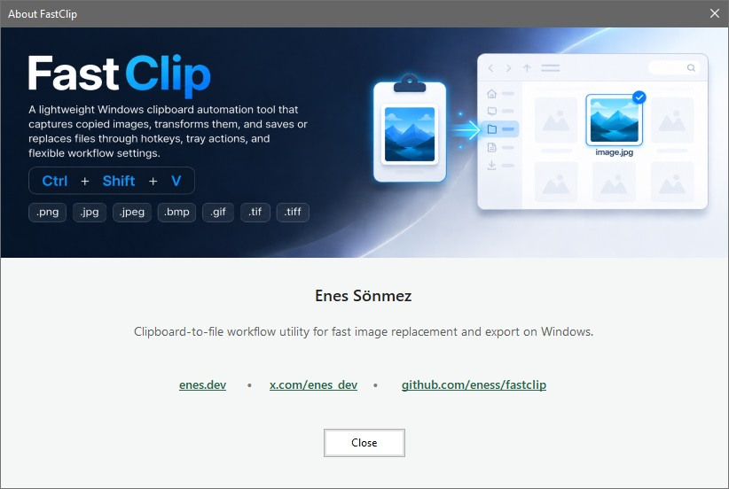

# FastClip

🖼️ A lightweight Windows tray utility that takes the current image from your clipboard and writes it into the file currently selected in Windows Explorer.

## Features

- Save clipboard images directly into files from Windows Explorer
- Replace the selected image or create a new file in the current folder
- Trigger actions with a customizable global hotkey from the tray
- Use `Advanced Mode` for resize, format selection, and optional JPEG or PNG compression before saving
- Save advanced settings and skip the dialog next time when needed
- Built for fast, reliable clipboard-to-file workflows on Windows

## 🧩 Supported Formats

- `.png`
- `.jpg`
- `.jpeg`
- `.bmp`
- `.gif`
- `.tif`
- `.tiff`

## ⚙️ How to Use?

1. Copy any image to the clipboard.
2. Select a target image file in Windows Explorer, or leave the folder open without a file selected.
3. Press `Ctrl+Shift+V`, or your configured hotkey.

The app saves the clipboard image into the selected file using that file's extension and format. If no file is selected, it creates a new randomly named file in the current Explorer folder. In `Advanced Mode`, you can choose the output format before saving.

## 📦 Build

This repository includes a GitHub Actions workflow that publishes both framework-dependent and self-contained `win-x64` builds.

- `framework-dependent`: much smaller, but requires the appropriate `.NET` runtime on the target machine
- `self-contained`: larger, but does not require a separate `.NET` installation

## 👤 Author

- Enes Sönmez
- X / Twitter: https://x.com/enes_dev
- Website: https://enes.dev
- GitHub: https://github.com/eness/fastclip
