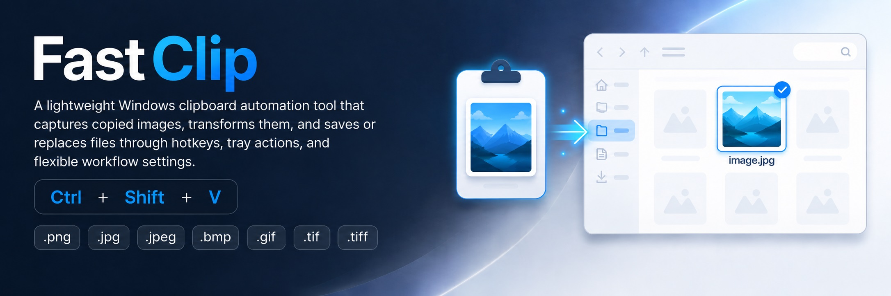

# Clipboard To Selected File

🖼️ A lightweight Windows tray utility that takes the current image from your clipboard and writes it into the file currently selected in Windows Explorer.

## ✨ What It Does

- Replaces the selected image file with the clipboard image
- Creates a new `.jpg` in the current Explorer folder when no file is selected
- Runs quietly in the system tray
- Uses a global hotkey: `Ctrl+Shift+V`
- Works well for fast image replacement workflows

## 🧩 Supported Formats

- `.png`
- `.jpg`
- `.jpeg`
- `.bmp`
- `.gif`
- `.tif`
- `.tiff`

## ⚙️ How It Works

1. Copy any image to the clipboard.
2. Select a target image file in Windows Explorer, or leave the folder open without a file selected.
3. Press `Ctrl+Shift+V`.

The app saves the clipboard image into the selected file using that file's extension and format. If no file is selected, it creates a new randomly named `.jpg` in the current Explorer folder.

## 📦 Build

This repository includes a GitHub Actions workflow that publishes both framework-dependent and self-contained `win-x64` builds.

- `framework-dependent`: much smaller, but requires the appropriate `.NET` runtime on the target machine
- `self-contained`: larger, but does not require a separate `.NET` installation

## 👤 Author

- Enes Sönmez
- X / Twitter: https://x.com/enes_dev
